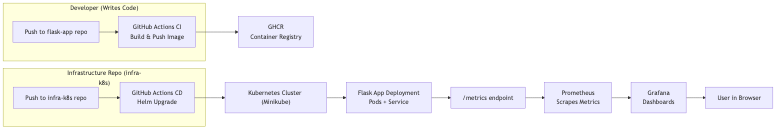

~~~{"variant":"document","id":"92733"}
# Architecture: CI → CD → Observability

This document summarizes the architecture used for the project.

## Overview

- CI: GitHub Actions in `flask-app` builds a multi-arch Docker image and pushes to GHCR.
- CD: GitHub Actions in `infra-k8s` (or self-hosted runner) runs `helm upgrade --install`.
- Kubernetes: Minikube (local) for demos; production would use GKE/EKS/AKS.
- Observability: kube-prometheus-stack (Prometheus + Grafana) + a ServiceMonitor.

## Diagram

## Notes & Links
- Flask repo: https://github.com/Ashukaushik3333/flask-app  
- Infra repo: https://github.com/Ashukaushik3333/infra-k8s
- Grafana dashboard snapshot: `assets/screenshots/README-placeholder.png`

